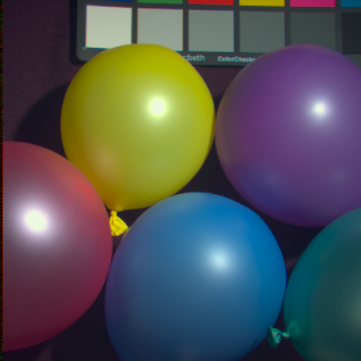
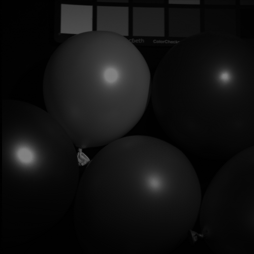

# Camera ISP Pipeline Simulation

This project simulates how a camera turns a scene into a final photo —
starting from raw spectral data, all the way to a finished RGB image.

It takes **multispectral images** (one image per light wavelength) and
processes them the same way a real camera sensor and image pipeline would,
step by step.

## Why this project

Understanding the camera image signal processing (ISP) pipeline — sensor
response, Bayer mosaicing, demosaicing, and color correction — is
fundamental to embedded vision, sensor design, and computational
photography. This project recreates that pipeline from scratch using real
camera sensor response curves, and compares two common demosaicing
algorithms to see how they affect image quality.

## What it does

1. **Load multispectral data** – reads a stack of images, each one
   showing how much light a scene reflects at a specific wavelength.

2. **Apply camera sensor response** – uses real camera spectral response
   (QE) curves to calculate how much red, green, and blue light the
   sensor would actually pick up.

3. **Build a Bayer RAW image** – arranges the R, G, B values into the
   same RGGB pattern used by real camera sensors (where each pixel only
   sees one color).

4. **Demosaicing** – fills in the missing colors to create a full RGB
   image. Two methods are compared:
   - **Bilinear interpolation** – fast and simple, but can blur edges.
   - **Edge-aware interpolation** – slower, but keeps edges sharper and
     reduces color artifacts.

5. **Post-processing** – applies white balance, color correction, and
   gamma correction to make the image look natural, like a real photo.

## Results

| Bilinear Demosaicing | Edge-Aware Demosaicing |
|---|---|
|  |  |

Simulated Bayer RAW image generated from the multispectral cube:



## Method comparison

| Feature | Bilinear Interpolation | Edge-Aware (AHD/Directional) |
|---|---|---|
| Edge sharpness | Low (blurry) | High (crisp) |
| Complexity | Very low (fastest) | Moderate to high |
| Artifacts | Zipper edges & color bleeding | Minimal artifacts |
| Best for | Low-power real-time preview | High-quality photography |

`compute_metrics.py` calculates PSNR and SSIM for both methods against a
reference RGB image built directly from the multispectral cube, so the
quality difference can be measured numerically rather than just visually.

## Project structure

```
camera-isp-simulation/
├── isp_pipeline.py       # main script - run this first
├── compute_metrics.py    # PSNR/SSIM comparison - run after isp_pipeline.py
├── requirements.txt      # required Python packages
├── data/
│   ├── balloons_ms/       # multispectral input images go here
│   ├── spectral response curve red.xlsx
│   ├── spectral response curve green.xlsx
│   └── spectral response curve blue.xlsx
└── outputs/                # generated images and metrics are saved here
```

## How to run

1. Install the required packages:
   ```
   pip install -r requirements.txt
   ```

2. Add your multispectral images to `data/balloons_ms/` and the camera
   QE curve files to the `data/` folder.

3. Run the main pipeline:
   ```
   python isp_pipeline.py
   ```

4. (Optional) Run the quality comparison:
   ```
   python compute_metrics.py
   ```

5. Check the `outputs/` folder for:
   - `bayer_preview.png` – the simulated raw sensor image
   - `final_bilinear.png` – final image using bilinear demosaicing
   - `final_edge_aware.png` – final image using edge-aware demosaicing
   - `metrics.md` – PSNR/SSIM comparison table

## Future work

- Add noise simulation (shot/read noise) before demosaicing for a more
  realistic sensor model.
- Try additional demosaicing algorithms (e.g. AHD, VNG).
- Auto-derive the color correction matrix (CCM) from a color chart in
  the scene instead of using fixed values.
- Add a denoising step after demosaicing.

## Data source

Multispectral images: [CAVE Multispectral Image Database](https://cave.cs.columbia.edu/repository/Multispectral)

## License

This project is licensed under the MIT License - see [LICENSE](LICENSE)
for details.
